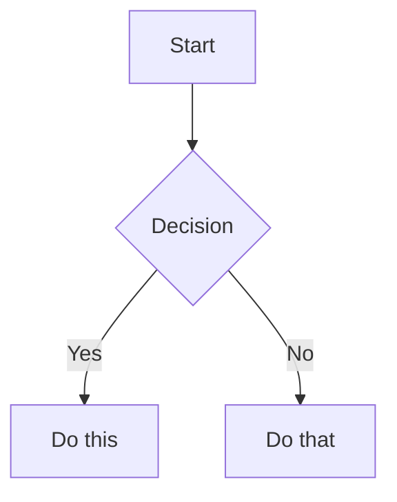

# Skill: defuddle

# Defuddle

Use Defuddle CLI to extract clean readable content from web pages. Prefer over WebFetch for standard web pages — it removes navigation, ads, and clutter, reducing token usage.

If not installed: `npm install -g defuddle`

## Usage

Always use `--md` for markdown output:

```bash
defuddle parse <url> --md
```

Save to file:

```bash
defuddle parse <url> --md -o content.md
```

Extract specific metadata:

```bash
defuddle parse <url> -p title
defuddle parse <url> -p description
defuddle parse <url> -p domain
```

## Output formats

| Flag | Format |
|------|--------|
| `--md` | Markdown (default choice) |
| `--json` | JSON with both HTML and markdown |
| (none) | HTML |
| `-p <name>` | Specific metadata property |

---

# Skill: json-canvas

# JSON Canvas Skill

## File Structure

A canvas file (`.canvas`) contains two top-level arrays following the [JSON Canvas Spec 1.0](https://jsoncanvas.org/spec/1.0/):

```json
{
  "nodes": [],
  "edges": []
}
```

- `nodes` (optional): Array of node objects
- `edges` (optional): Array of edge objects connecting nodes

## Common Workflows

### 1. Create a New Canvas

1. Create a `.canvas` file with the base structure `{"nodes": [], "edges": []}`
2. Generate unique 16-character hex IDs for each node (e.g., `"6f0ad84f44ce9c17"`)
3. Add nodes with required fields: `id`, `type`, `x`, `y`, `width`, `height`
4. Add edges referencing valid node IDs via `fromNode` and `toNode`
5. **Validate**: Parse the JSON to confirm it is valid. Verify all `fromNode`/`toNode` values exist in the nodes array

### 2. Add a Node to an Existing Canvas

1. Read and parse the existing `.canvas` file
2. Generate a unique ID that does not collide with existing node or edge IDs
3. Choose position (`x`, `y`) that avoids overlapping existing nodes (leave 50-100px spacing)
4. Append the new node object to the `nodes` array
5. Optionally add edges connecting the new node to existing nodes
6. **Validate**: Confirm all IDs are unique and all edge references resolve to existing nodes

### 3. Connect Two Nodes

1. Identify the source and target node IDs
2. Generate a unique edge ID
3. Set `fromNode` and `toNode` to the source and target IDs
4. Optionally set `fromSide`/`toSide` (top, right, bottom, left) for anchor points
5. Optionally set `label` for descriptive text on the edge
6. Append the edge to the `edges` array
7. **Validate**: Confirm both `fromNode` and `toNode` reference existing node IDs

### 4. Edit an Existing Canvas

1. Read and parse the `.canvas` file as JSON
2. Locate the target node or edge by `id`
3. Modify the desired attributes (text, position, color, etc.)
4. Write the updated JSON back to the file
5. **Validate**: Re-check all ID uniqueness and edge reference integrity after editing

## Nodes

Nodes are objects placed on the canvas. Array order determines z-index: first node = bottom layer, last node = top layer.

### Generic Node Attributes

| Attribute | Required | Type | Description |
|-----------|----------|------|-------------|
| `id` | Yes | string | Unique 16-char hex identifier |
| `type` | Yes | string | `text`, `file`, `link`, or `group` |
| `x` | Yes | integer | X position in pixels |
| `y` | Yes | integer | Y position in pixels |
| `width` | Yes | integer | Width in pixels |
| `height` | Yes | integer | Height in pixels |
| `color` | No | canvasColor | Preset `"1"`-`"6"` or hex (e.g., `"#FF0000"`) |

### Text Nodes

| Attribute | Required | Type | Description |
|-----------|----------|------|-------------|
| `text` | Yes | string | Plain text with Markdown syntax |

```json
{
  "id": "6f0ad84f44ce9c17",
  "type": "text",
  "x": 0,
  "y": 0,
  "width": 400,
  "height": 200,
  "text": "# Hello World\n\nThis is **Markdown** content."
}
```

**Newline pitfall**: Use `\n` for line breaks in JSON strings. Do **not** use the literal `\\n` -- Obsidian renders that as the characters `\` and `n`.

### File Nodes

| Attribute | Required | Type | Description |
|-----------|----------|------|-------------|
| `file` | Yes | string | Path to file within the system |
| `subpath` | No | string | Link to heading or block (starts with `#`) |

```json
{
  "id": "a1b2c3d4e5f67890",
  "type": "file",
  "x": 500,
  "y": 0,
  "width": 400,
  "height": 300,
  "file": "Attachments/diagram.png"
}
```

### Link Nodes

| Attribute | Required | Type | Description |
|-----------|----------|------|-------------|
| `url` | Yes | string | External URL |

```json
{
  "id": "c3d4e5f678901234",
  "type": "link",
  "x": 1000,
  "y": 0,
  "width": 400,
  "height": 200,
  "url": "https://obsidian.md"
}
```

### Group Nodes

Groups are visual containers for organizing other nodes. Position child nodes inside the group's bounds.

| Attribute | Required | Type | Description |
|-----------|----------|------|-------------|
| `label` | No | string | Text label for the group |
| `background` | No | string | Path to background image |
| `backgroundStyle` | No | string | `cover`, `ratio`, or `repeat` |

```json
{
  "id": "d4e5f6789012345a",
  "type": "group",
  "x": -50,
  "y": -50,
  "width": 1000,
  "height": 600,
  "label": "Project Overview",
  "color": "4"
}
```

## Edges

Edges connect nodes via `fromNode` and `toNode` IDs.

| Attribute | Required | Type | Default | Description |
|-----------|----------|------|---------|-------------|
| `id` | Yes | string | - | Unique identifier |
| `fromNode` | Yes | string | - | Source node ID |
| `fromSide` | No | string | - | `top`, `right`, `bottom`, or `left` |
| `fromEnd` | No | string | `none` | `none` or `arrow` |
| `toNode` | Yes | string | - | Target node ID |
| `toSide` | No | string | - | `top`, `right`, `bottom`, or `left` |
| `toEnd` | No | string | `arrow` | `none` or `arrow` |
| `color` | No | canvasColor | - | Line color |
| `label` | No | string | - | Text label |

```json
{
  "id": "0123456789abcdef",
  "fromNode": "6f0ad84f44ce9c17",
  "fromSide": "right",
  "toNode": "a1b2c3d4e5f67890",
  "toSide": "left",
  "toEnd": "arrow",
  "label": "leads to"
}
```

## Colors

The `canvasColor` type accepts either a hex string or a preset number:

| Preset | Color |
|--------|-------|
| `"1"` | Red |
| `"2"` | Orange |
| `"3"` | Yellow |
| `"4"` | Green |
| `"5"` | Cyan |
| `"6"` | Purple |

Preset color values are intentionally undefined -- applications use their own brand colors.

## ID Generation

Generate 16-character lowercase hexadecimal strings (64-bit random value):

```
"6f0ad84f44ce9c17"
"a3b2c1d0e9f8a7b6"
```

## Layout Guidelines

- Coordinates can be negative (canvas extends infinitely)
- `x` increases right, `y` increases down; position is the top-left corner
- Space nodes 50-100px apart; leave 20-50px padding inside groups
- Align to grid (multiples of 10 or 20) for cleaner layouts

| Node Type | Suggested Width | Suggested Height |
|-----------|-----------------|------------------|
| Small text | 200-300 | 80-150 |
| Medium text | 300-450 | 150-300 |
| Large text | 400-600 | 300-500 |
| File preview | 300-500 | 200-400 |
| Link preview | 250-400 | 100-200 |

## Validation Checklist

After creating or editing a canvas file, verify:

1. All `id` values are unique across both nodes and edges
2. Every `fromNode` and `toNode` references an existing node ID
3. Required fields are present for each node type (`text` for text nodes, `file` for file nodes, `url` for link nodes)
4. `type` is one of: `text`, `file`, `link`, `group`
5. `fromSide`/`toSide` values are one of: `top`, `right`, `bottom`, `left`
6. `fromEnd`/`toEnd` values are one of: `none`, `arrow`
7. Color presets are `"1"` through `"6"` or valid hex (e.g., `"#FF0000"`)
8. JSON is valid and parseable

If validation fails, check for duplicate IDs, dangling edge references, or malformed JSON strings (especially unescaped newlines in text content).

## Complete Examples

See [references/EXAMPLES.md](references/EXAMPLES.md) for full canvas examples including mind maps, project boards, research canvases, and flowcharts.

## References

- [JSON Canvas Spec 1.0](https://jsoncanvas.org/spec/1.0/)
- [JSON Canvas GitHub](https://github.com/obsidianmd/jsoncanvas)

## Reference: EXAMPLES.md

# JSON Canvas Complete Examples

## Simple Canvas with Text and Connections

```json
{
  "nodes": [
    {
      "id": "8a9b0c1d2e3f4a5b",
      "type": "text",
      "x": 0,
      "y": 0,
      "width": 300,
      "height": 150,
      "text": "# Main Idea\n\nThis is the central concept."
    },
    {
      "id": "1a2b3c4d5e6f7a8b",
      "type": "text",
      "x": 400,
      "y": -100,
      "width": 250,
      "height": 100,
      "text": "## Supporting Point A\n\nDetails here."
    },
    {
      "id": "2b3c4d5e6f7a8b9c",
      "type": "text",
      "x": 400,
      "y": 100,
      "width": 250,
      "height": 100,
      "text": "## Supporting Point B\n\nMore details."
    }
  ],
  "edges": [
    {
      "id": "3c4d5e6f7a8b9c0d",
      "fromNode": "8a9b0c1d2e3f4a5b",
      "fromSide": "right",
      "toNode": "1a2b3c4d5e6f7a8b",
      "toSide": "left"
    },
    {
      "id": "4d5e6f7a8b9c0d1e",
      "fromNode": "8a9b0c1d2e3f4a5b",
      "fromSide": "right",
      "toNode": "2b3c4d5e6f7a8b9c",
      "toSide": "left"
    }
  ]
}
```

## Project Board with Groups

```json
{
  "nodes": [
    {
      "id": "5e6f7a8b9c0d1e2f",
      "type": "group",
      "x": 0,
      "y": 0,
      "width": 300,
      "height": 500,
      "label": "To Do",
      "color": "1"
    },
    {
      "id": "6f7a8b9c0d1e2f3a",
      "type": "group",
      "x": 350,
      "y": 0,
      "width": 300,
      "height": 500,
      "label": "In Progress",
      "color": "3"
    },
    {
      "id": "7a8b9c0d1e2f3a4b",
      "type": "group",
      "x": 700,
      "y": 0,
      "width": 300,
      "height": 500,
      "label": "Done",
      "color": "4"
    },
    {
      "id": "8b9c0d1e2f3a4b5c",
      "type": "text",
      "x": 20,
      "y": 50,
      "width": 260,
      "height": 80,
      "text": "## Task 1\n\nImplement feature X"
    },
    {
      "id": "9c0d1e2f3a4b5c6d",
      "type": "text",
      "x": 370,
      "y": 50,
      "width": 260,
      "height": 80,
      "text": "## Task 2\n\nReview PR #123",
      "color": "2"
    },
    {
      "id": "0d1e2f3a4b5c6d7e",
      "type": "text",
      "x": 720,
      "y": 50,
      "width": 260,
      "height": 80,
      "text": "## Task 3\n\n~~Setup CI/CD~~"
    }
  ],
  "edges": []
}
```

## Research Canvas with Files and Links

```json
{
  "nodes": [
    {
      "id": "1e2f3a4b5c6d7e8f",
      "type": "text",
      "x": 300,
      "y": 200,
      "width": 400,
      "height": 200,
      "text": "# Research Topic\n\n## Key Questions\n\n- How does X affect Y?\n- What are the implications?",
      "color": "5"
    },
    {
      "id": "2f3a4b5c6d7e8f9a",
      "type": "file",
      "x": 0,
      "y": 0,
      "width": 250,
      "height": 150,
      "file": "Literature/Paper A.pdf"
    },
    {
      "id": "3a4b5c6d7e8f9a0b",
      "type": "file",
      "x": 0,
      "y": 200,
      "width": 250,
      "height": 150,
      "file": "Notes/Meeting Notes.md",
      "subpath": "#Key Insights"
    },
    {
      "id": "4b5c6d7e8f9a0b1c",
      "type": "link",
      "x": 0,
      "y": 400,
      "width": 250,
      "height": 100,
      "url": "https://example.com/research"
    },
    {
      "id": "5c6d7e8f9a0b1c2d",
      "type": "file",
      "x": 750,
      "y": 150,
      "width": 300,
      "height": 250,
      "file": "Attachments/diagram.png"
    }
  ],
  "edges": [
    {
      "id": "6d7e8f9a0b1c2d3e",
      "fromNode": "2f3a4b5c6d7e8f9a",
      "fromSide": "right",
      "toNode": "1e2f3a4b5c6d7e8f",
      "toSide": "left",
      "label": "supports"
    },
    {
      "id": "7e8f9a0b1c2d3e4f",
      "fromNode": "3a4b5c6d7e8f9a0b",
      "fromSide": "right",
      "toNode": "1e2f3a4b5c6d7e8f",
      "toSide": "left",
      "label": "informs"
    },
    {
      "id": "8f9a0b1c2d3e4f5a",
      "fromNode": "4b5c6d7e8f9a0b1c",
      "fromSide": "right",
      "toNode": "1e2f3a4b5c6d7e8f",
      "toSide": "left",
      "toEnd": "arrow",
      "color": "6"
    },
    {
      "id": "9a0b1c2d3e4f5a6b",
      "fromNode": "1e2f3a4b5c6d7e8f",
      "fromSide": "right",
      "toNode": "5c6d7e8f9a0b1c2d",
      "toSide": "left",
      "label": "visualized by"
    }
  ]
}
```

## Flowchart

```json
{
  "nodes": [
    {
      "id": "a0b1c2d3e4f5a6b7",
      "type": "text",
      "x": 200,
      "y": 0,
      "width": 150,
      "height": 60,
      "text": "**Start**",
      "color": "4"
    },
    {
      "id": "b1c2d3e4f5a6b7c8",
      "type": "text",
      "x": 200,
      "y": 100,
      "width": 150,
      "height": 60,
      "text": "Step 1:\nGather data"
    },
    {
      "id": "c2d3e4f5a6b7c8d9",
      "type": "text",
      "x": 200,
      "y": 200,
      "width": 150,
      "height": 80,
      "text": "**Decision**\n\nIs data valid?",
      "color": "3"
    },
    {
      "id": "d3e4f5a6b7c8d9e0",
      "type": "text",
      "x": 400,
      "y": 200,
      "width": 150,
      "height": 60,
      "text": "Process data"
    },
    {
      "id": "e4f5a6b7c8d9e0f1",
      "type": "text",
      "x": 0,
      "y": 200,
      "width": 150,
      "height": 60,
      "text": "Request new data",
      "color": "1"
    },
    {
      "id": "f5a6b7c8d9e0f1a2",
      "type": "text",
      "x": 400,
      "y": 320,
      "width": 150,
      "height": 60,
      "text": "**End**",
      "color": "4"
    }
  ],
  "edges": [
    {
      "id": "a6b7c8d9e0f1a2b3",
      "fromNode": "a0b1c2d3e4f5a6b7",
      "fromSide": "bottom",
      "toNode": "b1c2d3e4f5a6b7c8",
      "toSide": "top"
    },
    {
      "id": "b7c8d9e0f1a2b3c4",
      "fromNode": "b1c2d3e4f5a6b7c8",
      "fromSide": "bottom",
      "toNode": "c2d3e4f5a6b7c8d9",
      "toSide": "top"
    },
    {
      "id": "c8d9e0f1a2b3c4d5",
      "fromNode": "c2d3e4f5a6b7c8d9",
      "fromSide": "right",
      "toNode": "d3e4f5a6b7c8d9e0",
      "toSide": "left",
      "label": "Yes",
      "color": "4"
    },
    {
      "id": "d9e0f1a2b3c4d5e6",
      "fromNode": "c2d3e4f5a6b7c8d9",
      "fromSide": "left",
      "toNode": "e4f5a6b7c8d9e0f1",
      "toSide": "right",
      "label": "No",
      "color": "1"
    },
    {
      "id": "e0f1a2b3c4d5e6f7",
      "fromNode": "e4f5a6b7c8d9e0f1",
      "fromSide": "top",
      "fromEnd": "none",
      "toNode": "b1c2d3e4f5a6b7c8",
      "toSide": "left",
      "toEnd": "arrow"
    },
    {
      "id": "f1a2b3c4d5e6f7a8",
      "fromNode": "d3e4f5a6b7c8d9e0",
      "fromSide": "bottom",
      "toNode": "f5a6b7c8d9e0f1a2",
      "toSide": "top"
    }
  ]
}
```


---

# Skill: obsidian-bases

# Obsidian Bases Skill

## Workflow

1. **Create the file**: Create a `.base` file in the vault with valid YAML content
2. **Define scope**: Add `filters` to select which notes appear (by tag, folder, property, or date)
3. **Add formulas** (optional): Define computed properties in the `formulas` section
4. **Configure views**: Add one or more views (`table`, `cards`, `list`, or `map`) with `order` specifying which properties to display
5. **Validate**: Verify the file is valid YAML with no syntax errors. Check that all referenced properties and formulas exist. Common issues: unquoted strings containing special YAML characters, mismatched quotes in formula expressions, referencing `formula.X` without defining `X` in `formulas`
6. **Test in Obsidian**: Open the `.base` file in Obsidian to confirm the view renders correctly. If it shows a YAML error, check quoting rules below

## Schema

Base files use the `.base` extension and contain valid YAML.

```yaml
# Global filters apply to ALL views in the base
filters:
  # Can be a single filter string
  # OR a recursive filter object with and/or/not
  and: []
  or: []
  not: []

# Define formula properties that can be used across all views
formulas:
  formula_name: 'expression'

# Configure display names and settings for properties
properties:
  property_name:
    displayName: "Display Name"
  formula.formula_name:
    displayName: "Formula Display Name"
  file.ext:
    displayName: "Extension"

# Define custom summary formulas
summaries:
  custom_summary_name: 'values.mean().round(3)'

# Define one or more views
views:
  - type: table | cards | list | map
    name: "View Name"
    limit: 10                    # Optional: limit results
    groupBy:                     # Optional: group results
      property: property_name
      direction: ASC | DESC
    filters:                     # View-specific filters
      and: []
    order:                       # Properties to display in order
      - file.name
      - property_name
      - formula.formula_name
    summaries:                   # Map properties to summary formulas
      property_name: Average
```

## Filter Syntax

Filters narrow down results. They can be applied globally or per-view.

### Filter Structure

```yaml
# Single filter
filters: 'status == "done"'

# AND - all conditions must be true
filters:
  and:
    - 'status == "done"'
    - 'priority > 3'

# OR - any condition can be true
filters:
  or:
    - 'file.hasTag("book")'
    - 'file.hasTag("article")'

# NOT - exclude matching items
filters:
  not:
    - 'file.hasTag("archived")'

# Nested filters
filters:
  or:
    - file.hasTag("tag")
    - and:
        - file.hasTag("book")
        - file.hasLink("Textbook")
    - not:
        - file.hasTag("book")
        - file.inFolder("Required Reading")
```

### Filter Operators

| Operator | Description |
|----------|-------------|
| `==` | equals |
| `!=` | not equal |
| `>` | greater than |
| `<` | less than |
| `>=` | greater than or equal |
| `<=` | less than or equal |
| `&&` | logical and |
| `\|\|` | logical or |
| <code>!</code> | logical not |

## Properties

### Three Types of Properties

1. **Note properties** - From frontmatter: `note.author` or just `author`
2. **File properties** - File metadata: `file.name`, `file.mtime`, etc.
3. **Formula properties** - Computed values: `formula.my_formula`

### File Properties Reference

| Property | Type | Description |
|----------|------|-------------|
| `file.name` | String | File name |
| `file.basename` | String | File name without extension |
| `file.path` | String | Full path to file |
| `file.folder` | String | Parent folder path |
| `file.ext` | String | File extension |
| `file.size` | Number | File size in bytes |
| `file.ctime` | Date | Created time |
| `file.mtime` | Date | Modified time |
| `file.tags` | List | All tags in file |
| `file.links` | List | Internal links in file |
| `file.backlinks` | List | Files linking to this file |
| `file.embeds` | List | Embeds in the note |
| `file.properties` | Object | All frontmatter properties |

### The `this` Keyword

- In main content area: refers to the base file itself
- When embedded: refers to the embedding file
- In sidebar: refers to the active file in main content

## Formula Syntax

Formulas compute values from properties. Defined in the `formulas` section.

```yaml
formulas:
  # Simple arithmetic
  total: "price * quantity"

  # Conditional logic
  status_icon: 'if(done, "✅", "⏳")'

  # String formatting
  formatted_price: 'if(price, price.toFixed(2) + " dollars")'

  # Date formatting
  created: 'file.ctime.format("YYYY-MM-DD")'

  # Calculate days since created (use .days for Duration)
  days_old: '(now() - file.ctime).days'

  # Calculate days until due date
  days_until_due: 'if(due_date, (date(due_date) - today()).days, "")'
```

## Key Functions

Most commonly used functions. For the complete reference of all types (Date, String, Number, List, File, Link, Object, RegExp), see [FUNCTIONS_REFERENCE.md](references/FUNCTIONS_REFERENCE.md).

| Function | Signature | Description |
|----------|-----------|-------------|
| `date()` | `date(string): date` | Parse string to date (`YYYY-MM-DD HH:mm:ss`) |
| `now()` | `now(): date` | Current date and time |
| `today()` | `today(): date` | Current date (time = 00:00:00) |
| `if()` | `if(condition, trueResult, falseResult?)` | Conditional |
| `duration()` | `duration(string): duration` | Parse duration string |
| `file()` | `file(path): file` | Get file object |
| `link()` | `link(path, display?): Link` | Create a link |

### Duration Type

When subtracting two dates, the result is a **Duration** type (not a number).

**Duration Fields:** `duration.days`, `duration.hours`, `duration.minutes`, `duration.seconds`, `duration.milliseconds`

**IMPORTANT:** Duration does NOT support `.round()`, `.floor()`, `.ceil()` directly. Access a numeric field first (like `.days`), then apply number functions.

```yaml
# CORRECT: Calculate days between dates
"(date(due_date) - today()).days"                    # Returns number of days
"(now() - file.ctime).days"                          # Days since created
"(date(due_date) - today()).days.round(0)"           # Rounded days

# WRONG - will cause error:
# "((date(due) - today()) / 86400000).round(0)"      # Duration doesn't support division then round
```

### Date Arithmetic

```yaml
# Duration units: y/year/years, M/month/months, d/day/days,
#                 w/week/weeks, h/hour/hours, m/minute/minutes, s/second/seconds
"now() + \"1 day\""       # Tomorrow
"today() + \"7d\""        # A week from today
"now() - file.ctime"      # Returns Duration
"(now() - file.ctime).days"  # Get days as number
```

## View Types

### Table View

```yaml
views:
  - type: table
    name: "My Table"
    order:
      - file.name
      - status
      - due_date
    summaries:
      price: Sum
      count: Average
```

### Cards View

```yaml
views:
  - type: cards
    name: "Gallery"
    order:
      - file.name
      - cover_image
      - description
```

### List View

```yaml
views:
  - type: list
    name: "Simple List"
    order:
      - file.name
      - status
```

### Map View

Requires latitude/longitude properties and the Maps community plugin.

```yaml
views:
  - type: map
    name: "Locations"
    # Map-specific settings for lat/lng properties
```

## Default Summary Formulas

| Name | Input Type | Description |
|------|------------|-------------|
| `Average` | Number | Mathematical mean |
| `Min` | Number | Smallest number |
| `Max` | Number | Largest number |
| `Sum` | Number | Sum of all numbers |
| `Range` | Number | Max - Min |
| `Median` | Number | Mathematical median |
| `Stddev` | Number | Standard deviation |
| `Earliest` | Date | Earliest date |
| `Latest` | Date | Latest date |
| `Range` | Date | Latest - Earliest |
| `Checked` | Boolean | Count of true values |
| `Unchecked` | Boolean | Count of false values |
| `Empty` | Any | Count of empty values |
| `Filled` | Any | Count of non-empty values |
| `Unique` | Any | Count of unique values |

## Complete Examples

### Task Tracker Base

```yaml
filters:
  and:
    - file.hasTag("task")
    - 'file.ext == "md"'

formulas:
  days_until_due: 'if(due, (date(due) - today()).days, "")'
  is_overdue: 'if(due, date(due) < today() && status != "done", false)'
  priority_label: 'if(priority == 1, "🔴 High", if(priority == 2, "🟡 Medium", "🟢 Low"))'

properties:
  status:
    displayName: Status
  formula.days_until_due:
    displayName: "Days Until Due"
  formula.priority_label:
    displayName: Priority

views:
  - type: table
    name: "Active Tasks"
    filters:
      and:
        - 'status != "done"'
    order:
      - file.name
      - status
      - formula.priority_label
      - due
      - formula.days_until_due
    groupBy:
      property: status
      direction: ASC
    summaries:
      formula.days_until_due: Average

  - type: table
    name: "Completed"
    filters:
      and:
        - 'status == "done"'
    order:
      - file.name
      - completed_date
```

### Reading List Base

```yaml
filters:
  or:
    - file.hasTag("book")
    - file.hasTag("article")

formulas:
  reading_time: 'if(pages, (pages * 2).toString() + " min", "")'
  status_icon: 'if(status == "reading", "📖", if(status == "done", "✅", "📚"))'
  year_read: 'if(finished_date, date(finished_date).year, "")'

properties:
  author:
    displayName: Author
  formula.status_icon:
    displayName: ""
  formula.reading_time:
    displayName: "Est. Time"

views:
  - type: cards
    name: "Library"
    order:
      - cover
      - file.name
      - author
      - formula.status_icon
    filters:
      not:
        - 'status == "dropped"'

  - type: table
    name: "Reading List"
    filters:
      and:
        - 'status == "to-read"'
    order:
      - file.name
      - author
      - pages
      - formula.reading_time
```

### Daily Notes Index

```yaml
filters:
  and:
    - file.inFolder("Daily Notes")
    - '/^\d{4}-\d{2}-\d{2}$/.matches(file.basename)'

formulas:
  word_estimate: '(file.size / 5).round(0)'
  day_of_week: 'date(file.basename).format("dddd")'

properties:
  formula.day_of_week:
    displayName: "Day"
  formula.word_estimate:
    displayName: "~Words"

views:
  - type: table
    name: "Recent Notes"
    limit: 30
    order:
      - file.name
      - formula.day_of_week
      - formula.word_estimate
      - file.mtime
```

## Embedding Bases

Embed in Markdown files:

```markdown
![[MyBase.base]]

<!-- Specific view -->
![[MyBase.base#View Name]]
```

## YAML Quoting Rules

- Use single quotes for formulas containing double quotes: `'if(done, "Yes", "No")'`
- Use double quotes for simple strings: `"My View Name"`
- Escape nested quotes properly in complex expressions

## Troubleshooting

### YAML Syntax Errors

**Unquoted special characters**: Strings containing `:`, `{`, `}`, `[`, `]`, `,`, `&`, `*`, `#`, `?`, `|`, `-`, `<`, `>`, `=`, `!`, `%`, `@`, `` ` `` must be quoted.

```yaml
# WRONG - colon in unquoted string
displayName: Status: Active

# CORRECT
displayName: "Status: Active"
```

**Mismatched quotes in formulas**: When a formula contains double quotes, wrap the entire formula in single quotes.

```yaml
# WRONG - double quotes inside double quotes
formulas:
  label: "if(done, "Yes", "No")"

# CORRECT - single quotes wrapping double quotes
formulas:
  label: 'if(done, "Yes", "No")'
```

### Common Formula Errors

**Duration math without field access**: Subtracting dates returns a Duration, not a number. Always access `.days`, `.hours`, etc.

```yaml
# WRONG - Duration is not a number
"(now() - file.ctime).round(0)"

# CORRECT - access .days first, then round
"(now() - file.ctime).days.round(0)"
```

**Missing null checks**: Properties may not exist on all notes. Use `if()` to guard.

```yaml
# WRONG - crashes if due_date is empty
"(date(due_date) - today()).days"

# CORRECT - guard with if()
'if(due_date, (date(due_date) - today()).days, "")'
```

**Referencing undefined formulas**: Ensure every `formula.X` in `order` or `properties` has a matching entry in `formulas`.

```yaml
# This will fail silently if 'total' is not defined in formulas
order:
  - formula.total

# Fix: define it
formulas:
  total: "price * quantity"
```

## References

- [Bases Syntax](https://help.obsidian.md/bases/syntax)
- [Functions](https://help.obsidian.md/bases/functions)
- [Views](https://help.obsidian.md/bases/views)
- [Formulas](https://help.obsidian.md/formulas)
- [Complete Functions Reference](references/FUNCTIONS_REFERENCE.md)

## Reference: FUNCTIONS_REFERENCE.md

# Functions Reference

## Global Functions

| Function | Signature | Description |
|----------|-----------|-------------|
| `date()` | `date(string): date` | Parse string to date. Format: `YYYY-MM-DD HH:mm:ss` |
| `duration()` | `duration(string): duration` | Parse duration string |
| `now()` | `now(): date` | Current date and time |
| `today()` | `today(): date` | Current date (time = 00:00:00) |
| `if()` | `if(condition, trueResult, falseResult?)` | Conditional |
| `min()` | `min(n1, n2, ...): number` | Smallest number |
| `max()` | `max(n1, n2, ...): number` | Largest number |
| `number()` | `number(any): number` | Convert to number |
| `link()` | `link(path, display?): Link` | Create a link |
| `list()` | `list(element): List` | Wrap in list if not already |
| `file()` | `file(path): file` | Get file object |
| `image()` | `image(path): image` | Create image for rendering |
| `icon()` | `icon(name): icon` | Lucide icon by name |
| `html()` | `html(string): html` | Render as HTML |
| `escapeHTML()` | `escapeHTML(string): string` | Escape HTML characters |

## Any Type Functions

| Function | Signature | Description |
|----------|-----------|-------------|
| `isTruthy()` | `any.isTruthy(): boolean` | Coerce to boolean |
| `isType()` | `any.isType(type): boolean` | Check type |
| `toString()` | `any.toString(): string` | Convert to string |

## Date Functions & Fields

**Fields:** `date.year`, `date.month`, `date.day`, `date.hour`, `date.minute`, `date.second`, `date.millisecond`

| Function | Signature | Description |
|----------|-----------|-------------|
| `date()` | `date.date(): date` | Remove time portion |
| `format()` | `date.format(string): string` | Format with Moment.js pattern |
| `time()` | `date.time(): string` | Get time as string |
| `relative()` | `date.relative(): string` | Human-readable relative time |
| `isEmpty()` | `date.isEmpty(): boolean` | Always false for dates |

## Duration Type

When subtracting two dates, the result is a **Duration** type (not a number). Duration has its own properties and methods.

**Duration Fields:**
| Field | Type | Description |
|-------|------|-------------|
| `duration.days` | Number | Total days in duration |
| `duration.hours` | Number | Total hours in duration |
| `duration.minutes` | Number | Total minutes in duration |
| `duration.seconds` | Number | Total seconds in duration |
| `duration.milliseconds` | Number | Total milliseconds in duration |

**IMPORTANT:** Duration does NOT support `.round()`, `.floor()`, `.ceil()` directly. You must access a numeric field first (like `.days`), then apply number functions.

```yaml
# CORRECT: Calculate days between dates
"(date(due_date) - today()).days"                    # Returns number of days
"(now() - file.ctime).days"                          # Days since created

# CORRECT: Round the numeric result if needed
"(date(due_date) - today()).days.round(0)"           # Rounded days
"(now() - file.ctime).hours.round(0)"                # Rounded hours

# WRONG - will cause error:
# "((date(due) - today()) / 86400000).round(0)"      # Duration doesn't support division then round
```

## Date Arithmetic

```yaml
# Duration units: y/year/years, M/month/months, d/day/days,
#                 w/week/weeks, h/hour/hours, m/minute/minutes, s/second/seconds

# Add/subtract durations
"date + \"1M\""           # Add 1 month
"date - \"2h\""           # Subtract 2 hours
"now() + \"1 day\""       # Tomorrow
"today() + \"7d\""        # A week from today

# Subtract dates returns Duration type
"now() - file.ctime"                    # Returns Duration
"(now() - file.ctime).days"             # Get days as number
"(now() - file.ctime).hours"            # Get hours as number

# Complex duration arithmetic
"now() + (duration('1d') * 2)"
```

## String Functions

**Field:** `string.length`

| Function | Signature | Description |
|----------|-----------|-------------|
| `contains()` | `string.contains(value): boolean` | Check substring |
| `containsAll()` | `string.containsAll(...values): boolean` | All substrings present |
| `containsAny()` | `string.containsAny(...values): boolean` | Any substring present |
| `startsWith()` | `string.startsWith(query): boolean` | Starts with query |
| `endsWith()` | `string.endsWith(query): boolean` | Ends with query |
| `isEmpty()` | `string.isEmpty(): boolean` | Empty or not present |
| `lower()` | `string.lower(): string` | To lowercase |
| `title()` | `string.title(): string` | To Title Case |
| `trim()` | `string.trim(): string` | Remove whitespace |
| `replace()` | `string.replace(pattern, replacement): string` | Replace pattern |
| `repeat()` | `string.repeat(count): string` | Repeat string |
| `reverse()` | `string.reverse(): string` | Reverse string |
| `slice()` | `string.slice(start, end?): string` | Substring |
| `split()` | `string.split(separator, n?): list` | Split to list |

## Number Functions

| Function | Signature | Description |
|----------|-----------|-------------|
| `abs()` | `number.abs(): number` | Absolute value |
| `ceil()` | `number.ceil(): number` | Round up |
| `floor()` | `number.floor(): number` | Round down |
| `round()` | `number.round(digits?): number` | Round to digits |
| `toFixed()` | `number.toFixed(precision): string` | Fixed-point notation |
| `isEmpty()` | `number.isEmpty(): boolean` | Not present |

## List Functions

**Field:** `list.length`

| Function | Signature | Description |
|----------|-----------|-------------|
| `contains()` | `list.contains(value): boolean` | Element exists |
| `containsAll()` | `list.containsAll(...values): boolean` | All elements exist |
| `containsAny()` | `list.containsAny(...values): boolean` | Any element exists |
| `filter()` | `list.filter(expression): list` | Filter by condition (uses `value`, `index`) |
| `map()` | `list.map(expression): list` | Transform elements (uses `value`, `index`) |
| `reduce()` | `list.reduce(expression, initial): any` | Reduce to single value (uses `value`, `index`, `acc`) |
| `flat()` | `list.flat(): list` | Flatten nested lists |
| `join()` | `list.join(separator): string` | Join to string |
| `reverse()` | `list.reverse(): list` | Reverse order |
| `slice()` | `list.slice(start, end?): list` | Sublist |
| `sort()` | `list.sort(): list` | Sort ascending |
| `unique()` | `list.unique(): list` | Remove duplicates |
| `isEmpty()` | `list.isEmpty(): boolean` | No elements |

## File Functions

| Function | Signature | Description |
|----------|-----------|-------------|
| `asLink()` | `file.asLink(display?): Link` | Convert to link |
| `hasLink()` | `file.hasLink(otherFile): boolean` | Has link to file |
| `hasTag()` | `file.hasTag(...tags): boolean` | Has any of the tags |
| `hasProperty()` | `file.hasProperty(name): boolean` | Has property |
| `inFolder()` | `file.inFolder(folder): boolean` | In folder or subfolder |

## Link Functions

| Function | Signature | Description |
|----------|-----------|-------------|
| `asFile()` | `link.asFile(): file` | Get file object |
| `linksTo()` | `link.linksTo(file): boolean` | Links to file |

## Object Functions

| Function | Signature | Description |
|----------|-----------|-------------|
| `isEmpty()` | `object.isEmpty(): boolean` | No properties |
| `keys()` | `object.keys(): list` | List of keys |
| `values()` | `object.values(): list` | List of values |

## Regular Expression Functions

| Function | Signature | Description |
|----------|-----------|-------------|
| `matches()` | `regexp.matches(string): boolean` | Test if matches |


---

# Skill: obsidian-cli

# Obsidian CLI

Use the `obsidian` CLI to interact with a running Obsidian instance. Requires Obsidian to be open.

## Command reference

Run `obsidian help` to see all available commands. This is always up to date. Full docs: https://help.obsidian.md/cli

## Syntax

**Parameters** take a value with `=`. Quote values with spaces:

```bash
obsidian create name="My Note" content="Hello world"
```

**Flags** are boolean switches with no value:

```bash
obsidian create name="My Note" silent overwrite
```

For multiline content use `\n` for newline and `\t` for tab.

## File targeting

Many commands accept `file` or `path` to target a file. Without either, the active file is used.

- `file=<name>` — resolves like a wikilink (name only, no path or extension needed)
- `path=<path>` — exact path from vault root, e.g. `folder/note.md`

## Vault targeting

Commands target the most recently focused vault by default. Use `vault=<name>` as the first parameter to target a specific vault:

```bash
obsidian vault="My Vault" search query="test"
```

## Common patterns

```bash
obsidian read file="My Note"
obsidian create name="New Note" content="# Hello" template="Template" silent
obsidian append file="My Note" content="New line"
obsidian search query="search term" limit=10
obsidian daily:read
obsidian daily:append content="- [ ] New task"
obsidian property:set name="status" value="done" file="My Note"
obsidian tasks daily todo
obsidian tags sort=count counts
obsidian backlinks file="My Note"
```

Use `--copy` on any command to copy output to clipboard. Use `silent` to prevent files from opening. Use `total` on list commands to get a count.

## Plugin development

### Develop/test cycle

After making code changes to a plugin or theme, follow this workflow:

1. **Reload** the plugin to pick up changes:
   ```bash
   obsidian plugin:reload id=my-plugin
   ```
2. **Check for errors** — if errors appear, fix and repeat from step 1:
   ```bash
   obsidian dev:errors
   ```
3. **Verify visually** with a screenshot or DOM inspection:
   ```bash
   obsidian dev:screenshot path=screenshot.png
   obsidian dev:dom selector=".workspace-leaf" text
   ```
4. **Check console output** for warnings or unexpected logs:
   ```bash
   obsidian dev:console level=error
   ```

### Additional developer commands

Run JavaScript in the app context:

```bash
obsidian eval code="app.vault.getFiles().length"
```

Inspect CSS values:

```bash
obsidian dev:css selector=".workspace-leaf" prop=background-color
```

Toggle mobile emulation:

```bash
obsidian dev:mobile on
```

Run `obsidian help` to see additional developer commands including CDP and debugger controls.

---

# Skill: obsidian-markdown

# Obsidian Flavored Markdown Skill

Create and edit valid Obsidian Flavored Markdown. Obsidian extends CommonMark and GFM with wikilinks, embeds, callouts, properties, comments, and other syntax. This skill covers only Obsidian-specific extensions -- standard Markdown (headings, bold, italic, lists, quotes, code blocks, tables) is assumed knowledge.

## Workflow: Creating an Obsidian Note

1. **Add frontmatter** with properties (title, tags, aliases) at the top of the file. See [PROPERTIES.md](references/PROPERTIES.md) for all property types.
2. **Write content** using standard Markdown for structure, plus Obsidian-specific syntax below.
3. **Link related notes** using wikilinks (`[[Note]]`) for internal vault connections, or standard Markdown links for external URLs.
4. **Embed content** from other notes, images, or PDFs using the `![[embed]]` syntax. See [EMBEDS.md](references/EMBEDS.md) for all embed types.
5. **Add callouts** for highlighted information using `> [!type]` syntax. See [CALLOUTS.md](references/CALLOUTS.md) for all callout types.
6. **Verify** the note renders correctly in Obsidian's reading view.

> When choosing between wikilinks and Markdown links: use `[[wikilinks]]` for notes within the vault (Obsidian tracks renames automatically) and `[text](url)` for external URLs only.

## Internal Links (Wikilinks)

```markdown
[[Note Name]]                          Link to note
[[Note Name|Display Text]]             Custom display text
[[Note Name#Heading]]                  Link to heading
[[Note Name#^block-id]]                Link to block
[[#Heading in same note]]              Same-note heading link
```

Define a block ID by appending `^block-id` to any paragraph:

```markdown
This paragraph can be linked to. ^my-block-id
```

For lists and quotes, place the block ID on a separate line after the block:

```markdown
> A quote block

^quote-id
```

## Embeds

Prefix any wikilink with `!` to embed its content inline:

```markdown
![[Note Name]]                         Embed full note
![[Note Name#Heading]]                 Embed section
![[image.png]]                         Embed image
![[image.png|300]]                     Embed image with width
![[document.pdf#page=3]]               Embed PDF page
```

See [EMBEDS.md](references/EMBEDS.md) for audio, video, search embeds, and external images.

## Callouts

```markdown
> [!note]
> Basic callout.

> [!warning] Custom Title
> Callout with a custom title.

> [!faq]- Collapsed by default
> Foldable callout (- collapsed, + expanded).
```

Common types: `note`, `tip`, `warning`, `info`, `example`, `quote`, `bug`, `danger`, `success`, `failure`, `question`, `abstract`, `todo`.

See [CALLOUTS.md](references/CALLOUTS.md) for the full list with aliases, nesting, and custom CSS callouts.

## Properties (Frontmatter)

```yaml
---
title: My Note
date: 2024-01-15
tags:
  - project
  - active
aliases:
  - Alternative Name
cssclasses:
  - custom-class
---
```

Default properties: `tags` (searchable labels), `aliases` (alternative note names for link suggestions), `cssclasses` (CSS classes for styling).

See [PROPERTIES.md](references/PROPERTIES.md) for all property types, tag syntax rules, and advanced usage.

## Tags

```markdown
#tag                    Inline tag
#nested/tag             Nested tag with hierarchy
```

Tags can contain letters, numbers (not first character), underscores, hyphens, and forward slashes. Tags can also be defined in frontmatter under the `tags` property.

## Comments

```markdown
This is visible %%but this is hidden%% text.

%%
This entire block is hidden in reading view.
%%
```

## Obsidian-Specific Formatting

```markdown
==Highlighted text==                   Highlight syntax
```

## Math (LaTeX)

```markdown
Inline: $e^{i\pi} + 1 = 0$

Block:
$$
\frac{a}{b} = c
$$
```

## Diagrams (Mermaid)

````markdown

````

To link Mermaid nodes to Obsidian notes, add `class NodeName internal-link;`.

## Footnotes

```markdown
Text with a footnote[^1].

[^1]: Footnote content.

Inline footnote.^[This is inline.]
```

## Complete Example

````markdown
---
title: Project Alpha
date: 2024-01-15
tags:
  - project
  - active
status: in-progress
---

# Project Alpha

This project aims to [[improve workflow]] using modern techniques.

> [!important] Key Deadline
> The first milestone is due on ==January 30th==.

## Tasks

- [x] Initial planning
- [ ] Development phase
  - [ ] Backend implementation
  - [ ] Frontend design

## Notes

The algorithm uses $O(n \log n)$ sorting. See [[Algorithm Notes#Sorting]] for details.

![[Architecture Diagram.png|600]]

Reviewed in [[Meeting Notes 2024-01-10#Decisions]].
````

## References

- [Obsidian Flavored Markdown](https://help.obsidian.md/obsidian-flavored-markdown)
- [Internal links](https://help.obsidian.md/links)
- [Embed files](https://help.obsidian.md/embeds)
- [Callouts](https://help.obsidian.md/callouts)
- [Properties](https://help.obsidian.md/properties)

## Reference: CALLOUTS.md

# Callouts Reference

## Basic Callout

```markdown
> [!note]
> This is a note callout.

> [!info] Custom Title
> This callout has a custom title.

> [!tip] Title Only
```

## Foldable Callouts

```markdown
> [!faq]- Collapsed by default
> This content is hidden until expanded.

> [!faq]+ Expanded by default
> This content is visible but can be collapsed.
```

## Nested Callouts

```markdown
> [!question] Outer callout
> > [!note] Inner callout
> > Nested content
```

## Supported Callout Types

| Type | Aliases | Color / Icon |
|------|---------|-------------|
| `note` | - | Blue, pencil |
| `abstract` | `summary`, `tldr` | Teal, clipboard |
| `info` | - | Blue, info |
| `todo` | - | Blue, checkbox |
| `tip` | `hint`, `important` | Cyan, flame |
| `success` | `check`, `done` | Green, checkmark |
| `question` | `help`, `faq` | Yellow, question mark |
| `warning` | `caution`, `attention` | Orange, warning |
| `failure` | `fail`, `missing` | Red, X |
| `danger` | `error` | Red, zap |
| `bug` | - | Red, bug |
| `example` | - | Purple, list |
| `quote` | `cite` | Gray, quote |

## Custom Callouts (CSS)

```css
.callout[data-callout="custom-type"] {
  --callout-color: 255, 0, 0;
  --callout-icon: lucide-alert-circle;
}
```


## Reference: EMBEDS.md

# Embeds Reference

## Embed Notes

```markdown
![[Note Name]]
![[Note Name#Heading]]
![[Note Name#^block-id]]
```

## Embed Images

```markdown
![[image.png]]
![[image.png|640x480]]    Width x Height
![[image.png|300]]        Width only (maintains aspect ratio)
```

## External Images

```markdown


```

## Embed Audio

```markdown
![[audio.mp3]]
![[audio.ogg]]
```

## Embed PDF

```markdown
![[document.pdf]]
![[document.pdf#page=3]]
![[document.pdf#height=400]]
```

## Embed Lists

```markdown
![[Note#^list-id]]
```

Where the list has a block ID:

```markdown
- Item 1
- Item 2
- Item 3

^list-id
```

## Embed Search Results

````markdown
```query
tag:#project status:done
```
````


## Reference: PROPERTIES.md

# Properties (Frontmatter) Reference

Properties use YAML frontmatter at the start of a note:

```yaml
---
title: My Note Title
date: 2024-01-15
tags:
  - project
  - important
aliases:
  - My Note
  - Alternative Name
cssclasses:
  - custom-class
status: in-progress
rating: 4.5
completed: false
due: 2024-02-01T14:30:00
---
```

## Property Types

| Type | Example |
|------|---------|
| Text | `title: My Title` |
| Number | `rating: 4.5` |
| Checkbox | `completed: true` |
| Date | `date: 2024-01-15` |
| Date & Time | `due: 2024-01-15T14:30:00` |
| List | `tags: [one, two]` or YAML list |
| Links | `related: "[[Other Note]]"` |

## Default Properties

- `tags` - Note tags (searchable, shown in graph view)
- `aliases` - Alternative names for the note (used in link suggestions)
- `cssclasses` - CSS classes applied to the note in reading/editing view

## Tags

```markdown
#tag
#nested/tag
#tag-with-dashes
#tag_with_underscores
```

Tags can contain: letters (any language), numbers (not first character), underscores `_`, hyphens `-`, forward slashes `/` (for nesting).

In frontmatter:

```yaml
---
tags:
  - tag1
  - nested/tag2
---
```


---